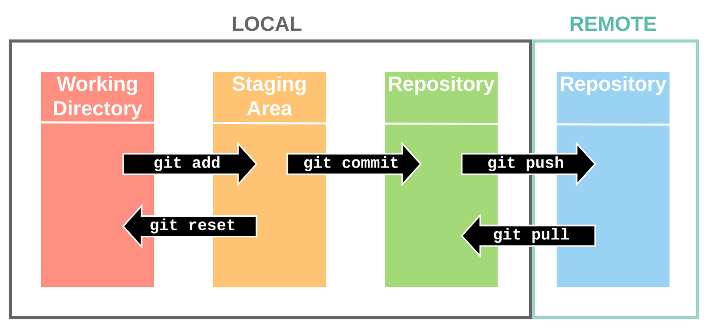

# **__Git__**

    

 

> **Pergunta:** Afinal de contas, o que é git e qual a diferença entre git e github ??
>
> [**Resposta**](./git_definition.md)

---

## **__Setup__**

- 1 - Primeiro temos que instalar o git em nosso computador.

  - [Instalando o Git](./git_install.md)

- 2 - Agora precisaremos configurar nosso git para que ele possa se comunicar com o github.

  - [Autenticação](./git_auth.md)

   

  > **__Observação:__**
  >
  > Iremos usar o GitHub em nossos exemplos.

 

> **__Alternativas ao GitHub:__**
>
> [GitLab](https://about.gitlab.com/)
>
> [BitBucket](https://bitbucket.org/)

---

## Git WorkFlow.

---

- 1 - Primeiro, iremos falar repositórios.

    - [Repositório](./repository.md)

- 2 - Segundo, iremos falar sobre a area de transição entre [ Working Directory ] -> [ Staging Area ].

  - [Staging Area](./git_staging.md)

  
