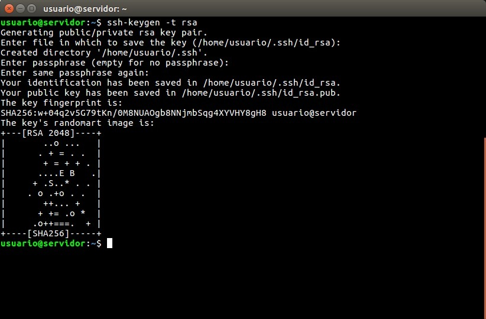

# Autenticação no GitHub usando SSH

Nesse caso iremos usar o [SSH](https://docs.github.com/pt/authentication/connecting-to-github-with-ssh/about-ssh) como autenticação, que é uma recomendação do próprio GitHub.

## Criando uma chave ssh

```bash
ssh-keygen -t ed25519 -C "your_email@example.com"
```

```bash
> Generating public/private ALGORITHM key pair[Press enter]
```

*É recomendável utilizar uma senha.*

```bash
> Enter passphrase (empty for no passphrase): [Type a passphrase]
> Enter same passphrase again: [Type passphrase again]
```

No final teremos isso.



Como vimos acima foram geradas duas chaves a id_ed25519 e a id_ed25519.pub.

## Sincronizando chaves

Agora precisamos pegar a chave pública e cadastrar no GitHub, para que ele possa comparar a nossa chave pública com a privada e autenticar-nos.

- Linux

    ```bash
    cat .ssh/id_rsa.pub
    ```

Copie sua chave ssh.

Deve ser algo semelhante a isso:

> ***Chave meramente ilustrativa***
>
>ssh-ed25519 AAAAC3NzaC1lZDI1NTE5AAAAIJl3dIeudNqd0DPMRD6OIh65tjkxFNOtwGcWB2gCgPhk email@email.com

<br>

- Agora vamos ao Github.

    Em seu perfil siga os seguintes passos:

  - 1

    

  - 2

    

  - 3

    

  - 4

    

  - 5

    

Pronto agora estamos autenticados, mas não acabou por aqui ainda, temos que configurar algumas coisas no git agora.

## Algumas configurações importantes

- ***Username***

    É recomendado usar o mesmo username do GitHub.

    ```bash
    git config --global user.name "Seu username"
    ```

- ***Email***

    É recomendado usar o mesmo email que você colocou como autenticação no ssh.

    ```bash
    git config --global user.email "youremail@yourdomain.com"
    ```

- ***Branch***

    Ainda não aprendemos sobre branch, mas é recomendado a troca do nome de master para main.

    >Leia mais sobre em:
    >
    ><https://sfconservancy.org/news/2020/jun/23/gitbranchname/>

    ```bash
    git config --global init.defaultBranch main
    ```

> Caso queira ler mais sobre autenticação com ssh no GitHub.
>
><https://docs.github.com/pt/authentication/connecting-to-github-with-ssh>
