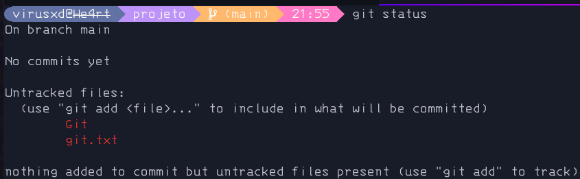
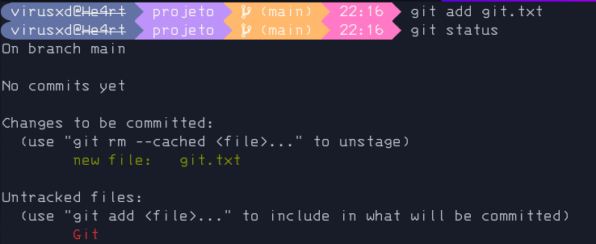
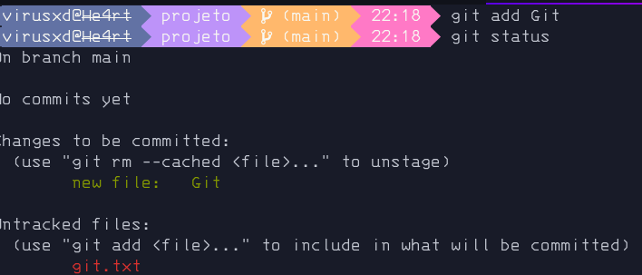
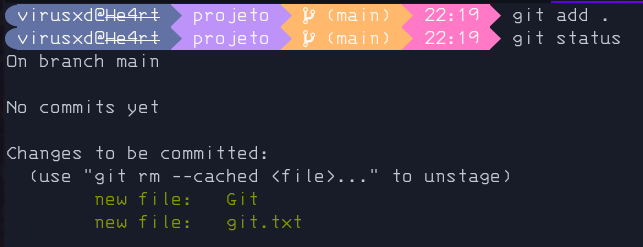
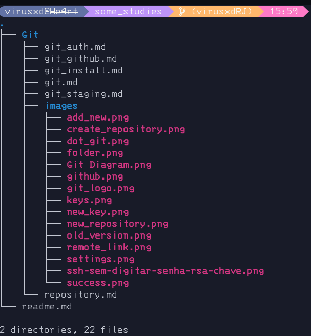
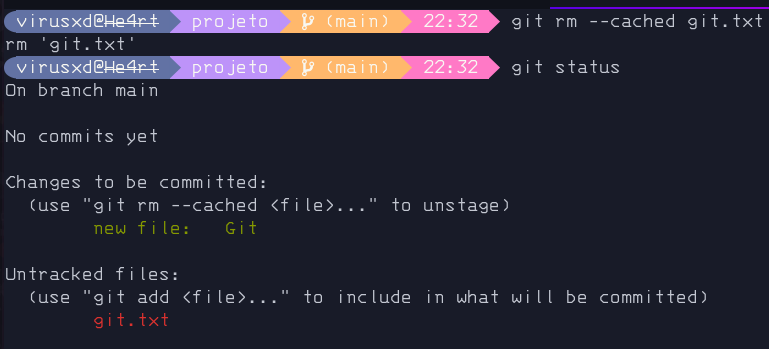
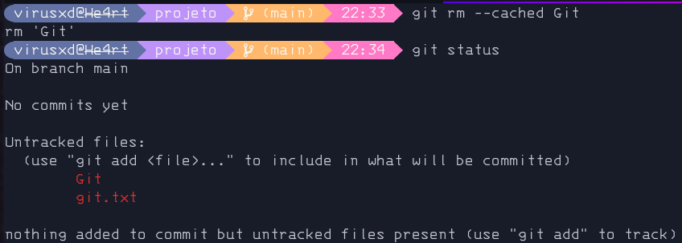
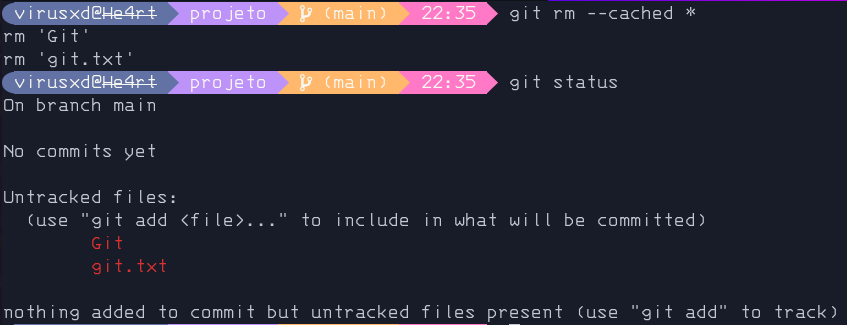

# Staging Area

A staging area podemos imaginar que é a area de preparo de nossos arquivos.

> Pergunta: Como assim area de preparo.
>
> Resposta: Para responder essa perrgunta irei fazer uma analogia a um sistemas de entregas de mercadoria.

- Status.

    O comando status será nosso maior aliado, com ele podemos ver tudo que está acontecendo em staging.

    ```
    git status
    ```

    <details>
      <summary>
        Ilustração
      </summary>
      
    </details>

    > **__Analogia__**
    >
    > O status seria o "Rastrear Entrega" do nosso sitema.

- Mandando nossos arquivos para area de staging:

    ```bash
    git add <archive>
    ```

    - Um arquivo:

        no lugar de <archive> colocaremos o caminho para o arquivo.

        ex: 

        ```bash
        git add git.txt 
        ```

        <details>
          <summary>
            Ilustração
          </summary>
          
        </details>

    - Uma pasta:

        no lugar de <archive> colocaremos o caminho para o pasta.

        ex: 

        ```bash
        git add ./Git/ 
        ```

        <details>
          <summary>
            Ilustração
          </summary>
          
        </details>

    - Um projeto:

        no lugar de <archive> colocaremos ".".

        ex: 

        ```bash
        git add .
        ```

        <details>
          <summary>
            Ilustração
          </summary>
          
        </details>

        > **__Observação:__**
        >
        > Uma vez dentro da pasta do projeto ele pegará todos arquivos e pastas detro dele.
        >
        > **__O Git verá nosso projeto assim:__**
        >
        > <details><summary>Projeto</summary></details>

    > **__Analogia:__**
    >
    > O add seria similar a loja postando uma mercadoria.

- Removendo nossos arquivos de staging: 

    ```bash
    git rm --cached <archive>
    ```

    - Um arquivo:

        ```bash
        git rm --cached git.txt
        ```

        <details>
          <summary>
            Ilustração
          </summary>
          
        </details>

    - Uma pasta:

        ```bash
        git rm --cached Git
        ```

        <details>
          <summary>
            Ilustração
          </summary>
          
        </details>

    - Tudo que está em staging:

        ```bash
        git rm --cached *
        ```

        <details>
          <summary>
            Ilustração
          </summary>
          
        </details>

    > **__Analogia:__**
    >
    > Imagine que tenha dado algum problema com o produto na trasportadora e ele foi devolvido à loja.