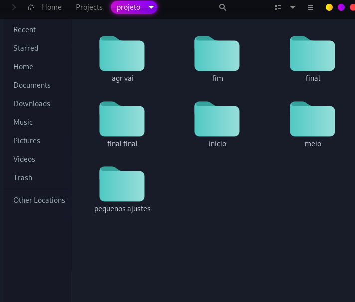
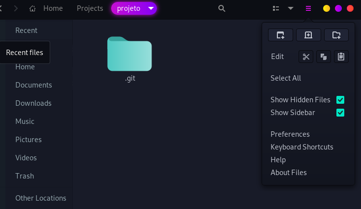
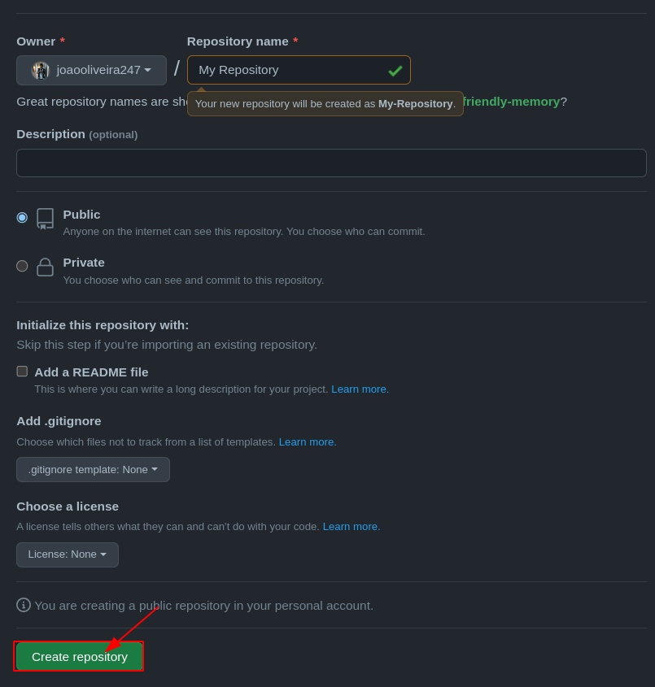
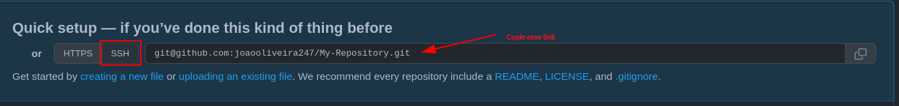

# Repositório

<br>

<p align="center">
    
</p>
<br>

Repositório é um diretório onde os arquivos do seu projeto ficam armazenados. Ele pode ficar em um depósito do GitHub ou em seu computador. Você pode armazenar códigos, imagens, áudios, ou qualquer outra coisa relacionada ao projeto no diretório.

> Pergunta: Ué, então um repositório é uma pasta ??
>
> Resposta: Basicamente, sim.

- 1 - Transformando uma pasta local em um repositório git.

    > Pergunta: Mas um repositório não seria como uma pasta, porque não podemos então só fazer o upload da pasta??
    >
    > Resposta: Para facilitar a compreensão podemos dizer que sim, mas um repositório é usado para versionamento, evitando coisas como mostrado abaixo.
    >
    >  


    - Para transformamos uma pasta em repositório basta executarmos o comando abaixo:

        ```bash
            git init
        ```

        > Pergunta: mas como sei q ele se tornou um repositório ??
        >
        > Resposta: todo repositorio git terá dentro dele um arquivo nomeado .git, que é a maneira que o git sabe que a pasta é um repositório.
        >
        >
        >
        > __OBS__: Geralmente essa pasta não é mostrada por padrão.

- 2 - Criando um repositório no GitHub.

    > Pergunta: Ué, mas para que precisamos criar um repositório no GitHub ???
    >
    > Resposta: Precisaremos criar um repositório no GitHub para linka-lo com o nosso local.

    - 1 
         

    - 2
        

- 3 - Linkando um repositório local ao GitHub.

    Agora precisaremos linkar nosso repositório.

    ```bash
    git remote add <apelido> <link>
    ```

    Obtendo link:

    

    O comando completo ficará algo parecido com isso:

    ```bash
    git remote add origin git@github.com:joaooliveira247/My-Repository.git
    ```

    > __Observação:__
    >
    > Por convenção usamos o nome origin como apelido

Pronto, agora seu repositório local está linkado com seu repositório no GitHub.
